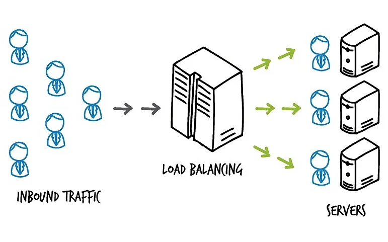
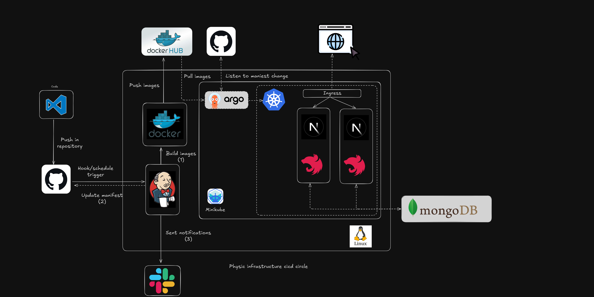

# Blog writting webapp using MERN Stack with CI/CD
---
Basic structure will be:


---
### SETUP
##### *This project used MongoDB as BD and other config in .env file thus, the .env is necessary for the app especially I have studing devops and cloud recently.*


- Add .env in `client\.env.local` and `client\.env.production` (NextJS-frontend server)
```
NEXT_PUBLIC_SERVER=http://localhost:5000
NEXT_PUBLIC_IMG=http://localhost:5000
```

- Add .env in `nest\.env` (NestJS server)
```
MONGO_URL=""
PORT=
```

- Add  `server\.env.local` and  `server\.env.production` (Express server)
```
DB_URL=
PORT=
DB_USERNAME=
DB_PASSWORD=
```

---
### Run local:

Open 2 different terminal prompt
1. cd client->npm run dev
2. cd server->npm run dev
---
#### Run with docker-copmose
(Docker eninge required)
At root dir : `docker-compose up`

---
### Intergration with Dockerhub and Jenkins
**(jenkins with credential and key with github repo are required)**

*I can not show the detail configs with credential here because I don't know to show it how.*

Basiclly, this is the workflow:


In short, you commit some change in code to github and 5 mins later, the web will change as you want.

**SETUP:**
- Make sure you have dockerhub account and know your image for each container server.
- Edit pipeline in `Jenkinsfile` as **your config in jenkins**, mostly the name and variable.

I'm not bốc phét. This project somehow work and I could in AWS in 2024 but i can't proof. It's a long time ago and I don't even remember 😔


### With Minikube (local K8s)
#### **k8s note**:
**(kubectl, minikube, argo installed with credential and key with github repo are required)**
- Add MongoDB info in `k8s\secret.yaml` with base64 encoded but use a *base64 encode first* with
```yaml
data:
  DB_URL: 
  MONGO_URL: 
  PORT: 
  DB_USERNAME: 
  DB_PASSWORD: 
```

- Change the docker image in `k8s\app-deployment.yaml` to your built from this project.
- After all, push into **your own private github** (for secure reason) and add the github link to `application.yaml`
